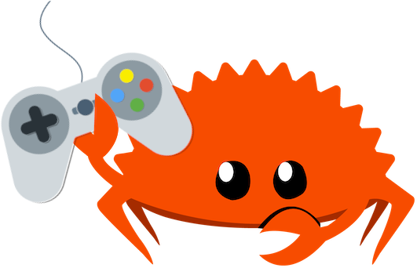

# breakout
----

- play [at](https://chrnz008.github.io/breakout)

```rust
todo!();
```
- better villan layout

a [breakout](https://en.wikipedia.org/wiki/Breakout_(video_game)) clone in rust
made with [macroquad](https://macroquad.rs)




run it with: `cargo r`


